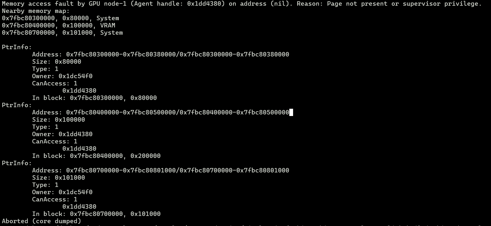

# 背景

最近在做一个项目，其中涉及到构建一个函数，函数的输入是一个内存地址，函数需要解析这个内存地址中的值然后执行相应的动作。已知的是输入的内存地址是 int64 类型的数值，代表的是 amdgpu scratch memory 中的一个地址。

基于项目当前的架构，我的设计是在 opencl 中实现这个函数，然后将这个函数编译到一个 bitcode 文件中，作为一个 bitcode 文件，它可以在项目编译的时候通过 -mlink-builtin-bitcode 链接进来，调用方只需要在模块中正确地声明这个函数就可以。

这个函数是在 runtime 执行的，因为在编译期间不能获取到内存中存的数值。

# 问题浮现

当我完成函数代码的编写，并且成功编译到可执行文件，看起来一切顺利。但是当我运行可执行文件的时候，意外发生了，出现了 Page Fault 的错误。



# 原因分析

经过一盘排查之后，发现问题出在加载了非法的指针地址。输入的指针地址指向的是 scratch 地址空间（i8 addrspace(5)*），为了可以访问这个地址，我通过 inttoptr 将其转换到了 generic 地址空间的指针（i8*），然后再访问这个地址。我用下面的伪代码来表达一下这番操作：

```llvm
define protected void void @foo(i64 %0) {
Entry:
  %1 = inttoptr i64 %0 to i8*
  %2 = load i8, i8* %1, align 1
  ...
}
```

而调用方首先通过 ptrtoint 将 i8 addrspace(5)* 转成了 int64，所以整个流程可以简化为下面的伪代码：

```llvm
define amdgpu_kernel void @bar(...) {
Entry:
  %0 = ptrtoint i8 addrspace(5)* %ptr to i64
  %1 = inttoptr i64 %0 to i8*
  %2 = load i8, i8* %1, align 1
  ...
}
```

看起来一切都符合逻辑，除了 scratch 的地址空间被转到了 generic 的地址空间，但是理论上 generic 指针也可以处理 scratch 的指针，只要指针指向的地址没有改变就可以了。但是指针指向的地址确实被改变了！

因为在 amdgpu 中，generic 地址空间的指针的位宽是64，而 scratch 地址空间的指针的位宽是32，因此在编译器看来，将 i8 addrspace(5)* 的指针转到 i64 是完全没有必要的，只要32位就可以了。因此，在 inst-combine-pass 之后，ir 大概被优化成了这样：

```llvm
define amdgpu_kernel void @bar(...) {
Entry:
  %0 = ptrtoint i8 addrspace(5)* %ptr to i32
  %1 = inttoptr i32 %0 to i8*
  %2 = load i8, i8* %1, align 1
  ...
}
```

问题在于，我是通过 i8* 来访问指针的，在最终生成的汇编中，这对应到的是 flat_load_sbyte 指令，而它需要通过地址的高32位来判断这个地址是哪个地址空间的，但是这里的指针所指向的地址只有低32位！因此无法将这个地址映射到合法的物理地址。

> 64位地址模式的flat指令，需要vgpr的[48:46]==100才能取scratch空间的数据
> 

通过下面的汇编可以看到，flat_load_sbyte 指令面对的地址是 0x8，这显然不是一个合法的虚拟地址。


我猜测 %0 是不包含地址空间的信息的，只要将其先转到 i8 addrspace(5)* 再进行加载（此时汇编指令是 buffer_load_sbyte），那也就不需要额外的地址空间信息，因此是没有问题的。但是我大意了没有转。

# 关联的奇怪现象

## 循环展开

以上的 llvm ir 其实是可以被优化掉的，编译器会发现没有必要转来转去，而是会直接去访问原始的指针。实际上，以上的 llvm ir 片段是出现在一个 for 循环中，每次循环会访问这个地址的下一个元素。

我在排查的时候发现，如果这个循环可以完全展开，比方说循环的次数是静态的，并且编译器将循环完全展开了，那么对这个地址访问的偏移都是静态的，编译器会将对应的 inttoptr 和 ptrtoint 都消掉，直接访问原始的指针，此时是不会出现显存错误的。

而如果循环是不能完全展开的，比方说循环的次数是个变量，那么编译器只会老老实实地执行所有的 inttoptr 和 ptrtoint，也就会如前所述访问到非法的地址。

**至于为什么会有这个差别，我还没有深入细究。**

## hipcc 已经知道了

我尝试用 hip 来复现这个问题，如下所示，我先在 scratch 分配一块空间，然后返回这个地址的数值：

```cpp
__device__ void foo(long *ret) {
  char a[10];
  *ret = a;
}
```

当我用 hipcc 编译并且运行后，惊讶地发现返回的地址的数值在高32位设置了 flag 来标注 scratch 的地址空间。查看 hipcc 生成的 llvm ir 之后，我发现 clang 插入了一条 addrspace cast 的指令来将数组 a 的地址空间转换到 generic 的地址空间，之后才执行了取地址的操作。想必 addrspace cast 在指针地址中插入了地址空间的信息。这个动作是在 AST 生成 llvm ir 的时候做的，而不是哪个优化 pass 做的。看来 hipcc 确实考虑比较全面，是个成熟的工具。

# 结论

1. 在 llvm ir 中处理指针数值的时候，先用 addrspace cast 将其转到 generic 地址空间；
2. 在访问指针的时候，如果知道指针的地址空间，那就首先将其转到对应的地址空间。
